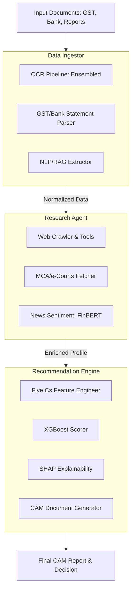

# 🏦 IntelliCAM — AI-Powered Corporate Credit Decisioning Engine

<div align="center">


**Next-Gen Corporate Credit Appraisal: Bridging the Intelligence Gap**

</div>

---

## 🎯 Overview

IntelliCAM is an **industrial-grade AI-powered Credit Decisioning Engine** designed to automate the preparation of a **Comprehensive Credit Appraisal Memo (CAM)** for corporate loan applications.

By integrating multi-source data extraction with autonomous research agents, IntelliCAM evaluates borrowers across the **Five Cs of Credit**, providing a fully explainable, data-driven credit score and executive summary in minutes.

---

## 🏗️ Technical Architecture



---

## 📁 System Structure

```bash
IntelliCAM/
├── src/
│   ├── api/                    # Master FastAPI Orchestration
│   ├── ingestor/               # Data Ingestion & Normalization
│   │   ├── ocr/                # EasyOCR + Tesseract Ensemble
│   │   ├── structured/         # Financial Document Parsers
│   │   └── nlp/                # RAG Extraction Pipeline
│   ├── research/               # Autonomous Research Agent
│   │   └── tools/              # MCA, eCourts, News Analysis
│   ├── engine/                 # Recommendation & Scoring Engine
│   │   ├── features/           # Five Cs Engineering
│   │   ├── model/              # XGBoost + Rule Engines
│   │   └── cam/                # PDF/Word Report Generation
│   └── portal/                 # Decision Support UI
├── tests/                      # Unit & Integration Suite
├── configs/                    # System Configuration
└── models/                     # Trained Model Artifacts
```

---

## 🚀 Quick Start

### 1. Environment Setup
```bash
# Clone the repository
git clone https://github.com/ankushsingh003/IntelliCAM.git
cd IntelliCAM

# Create and activate virtual environment
python -m venv .venv
source .venv/bin/activate  # Unix
.venv\Scripts\activate     # Windows

# Install dependencies
pip install -r requirements.txt
```

### 2. Configuration
Create a `.env` file from the example and provide your API keys:
```bash
cp .env.example .env
```

| Key | Purpose |
|---|---|
| `OPENAI_API_KEY` | GPT-4o for Synthesis & RAG |
| `TAVILY_API_KEY` | Real-time Web Research |
| `DATABRICKS_HOST` | Analytics Workspace |

### 3. Execution
```bash
# Start the Master API
uvicorn src.api.main:app --reload --port 8000

# Run Verification Suite
pytest tests/ -v
```

---

## ⚖️ The Five Cs Framework

IntelliCAM quantifies credit risk by weighting signals across five critical dimensions:

| Dimension | Weight | Primary Data Sources |
|---|---|---|
| **Character** | 25% | Litigation records, Adverse news, MCA history |
| **Capacity** | 30% | GST filings, Bank statements, DSCR/EBITDA |
| **Capital** | 20% | Balance Sheets, Net worth, D/E ratios |
| **Collateral** | 15% | MCA Charge register, LTV assessments |
| **Conditions** | 10% | Sectoral outlook, Macroeconomic news |

---

## 📄 License

Distributed under the MIT License. See `LICENSE` for more information.
